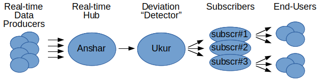

# Ukur 
Ukur detects and enable subscriptions for deviations in traffic based on real-time information from Anshar.
The name Ukur follows the naming standard with names from Sumerian gods; Ukur is a god of the underworld (where 
probably deviations also have their origin...).

See the [functional description](functional_description.md) for details about how to subscribe to deviations 
and how deviations are found. 

The [technical description](technical_description.md) attempts to give an idea of how Ukur is built and
how to deploy and monitor it.

