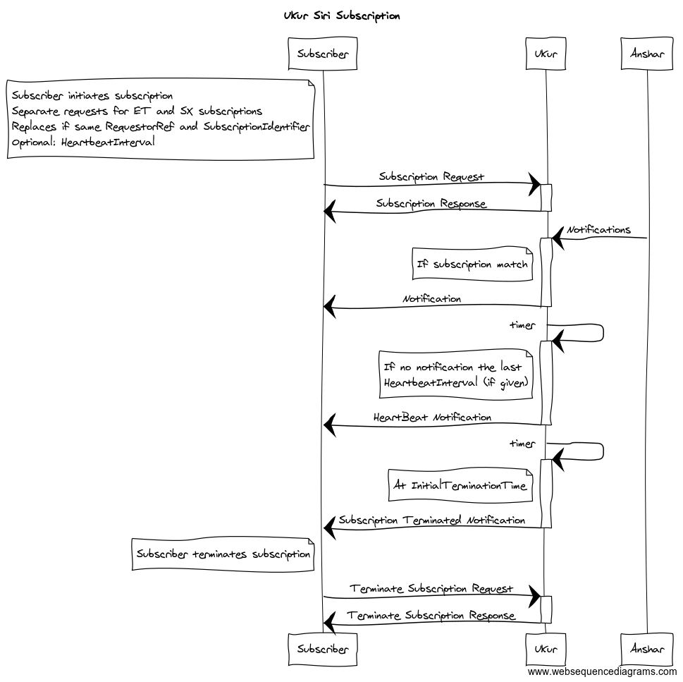

# Ukur - Functional documentation

This is a functional description of how Ukur works.

## Subscriptions

There are two ways to create and maintain subscriptions in Ukur: a original json way and the standardized SIRI format with XML. 
The latter does not support subscriptions on to- and from-stops, but otherwise they are quite similar. Ukur is not intended to
push messages directly to end-user clients, instead it is expected that the subscriber handles that with knowledge about what 
to push, how often etc. Also the subscriber should make sure that similar subscriptions to end-users result in only one 
subscription to Ukur.  

### Properitary JSON format 

To subscribe, **post** subscription data to https://{BASE_URL}/subscription as `application/json`.  

The subscription must contain a logical name, a public reachable push address and what is subscribed upon: from and 
to stops and/or lines and/or codespaces. It is optional to specify:
- type: ALL is default
- useSiriSubscriptionModel: if notifications should be wrapped in a Siri root, default is false
- initialTerminationTime: when the subscriptions should be deleted, default is null (meaning never)
- heartbeatInterval: period for heartbeats according to the Duration format from the W3C XML Schema 1.0 at 
  which heartbeats (empty Siri/HeartbeatNotification xml messages) should be sent to the push address, default 
  is null (no heartbeats). The intervall is handled approximately, and notifications can come several seconds 
  later than what is specified (depending of how often we configure Ukur to handle heartbeats)...
```json
{
   "name" : "Test subscription",
   "pushAddress": "https://myserver/push",
   "type": "ALL",
   "fromStopPoints" : [ "NSR:Quay:551", "NSR:Quay:553", "NSR:Quay:550" ],
   "toStopPoints" : [ "NSR:Quay:695", "NSR:Quay:696" ],
   "lineRefs" : ["NSB:Line:L14", "NSB:Line:R11"],
   "codespaces" : ["NSB", "RUT"],
   "useSiriSubscriptionModel" : false,
   "initialTerminationTime" : "9999-01-01T00:00:00+01:00",
   "heartbeatInterval" : "PT15M",
   "pushAllData" : false
 }
 ```   
After successfull creation of the new subscription, Ukur responds with the same object with
the id-attribute set. This id can be used to remove the subscription by issuing a http **delete** 
to https://{BASE_URL}/subscription/{subscriptionId}. Update is supported: just post a subscription with
the proper id and desired new state to https://{BASE_URL}/subscription/. 

Type is used to specify if ALL messages should be pushed, or just ET or SX. (Legal values are 
ALL, SX and ET - ALL is used if none is specified.)

StopPoints are fully qualified national ids on stop places and quays, use 
[Stoppestedsregisteret](https://stoppested.entur.org) to look them up. The SIRI messages received from 
Anshar uses both stop places and quays to identify affected stops, Ukur maps stop places to quays so the
subscription does not have to specify quays unless only certain quays are interesting. Stops not following
the national id format are ignored (as they never will be referenced). Also both from and to StopPoints
must be present to receive push messages.

'pushAllData' can be set to true if all realtime messages matching the subscription should be pushed, and
not just those with deviations.


### XML (SIRI) format
We support 'Publish/Subscribe - Direct delivery' from the SIRI specification. The sequence diagram below shows
the lifecycle of such a data transfer. We currently support SIRI-SX and SIRI-ET subscriptions, and they must 
provide filters for either codespace or lineref(s) (subscriptions on from- and to-stops are not supported). 



To create (or replace if same RequestorRef + SubscriptionIdentifier) a subscription one must post one of the 
following subscription requests to https://{BASE_URL}/siri-subscription/. If a codespace subscription is wanted, 
add the codespace to the url: https://{BASE_URL}/siri-subscription/{CODESPACE}/.

#### SX Subscription Request
```xml
<Siri version="2.0" xmlns="http://www.siri.org.uk/siri">
    <SubscriptionRequest>
        <RequestTimestamp>2018-06-01T11:21:17.524+02:00</RequestTimestamp>
        <!-- Make sure the address is reachable from Ukur -->
        <Address>https://server:port/pushaddress</Address>
        <!-- Besides beeing required by the schema, RequestorRef is used in combination -->
        <!-- with SubscriptionIdentifier to uniqely identify the subscription           -->
        <RequestorRef>Requestor</RequestorRef>
        <SubscriptionContext>
            <!-- Optional: if no HeartbeatInterval is provided, no heartbeat notifications are sent -->
            <HeartbeatInterval>PT1M</HeartbeatInterval>
        </SubscriptionContext>
        <SituationExchangeSubscriptionRequest>
            <!-- The subscriber must provide a unique SubscriptionIdentifier -->
            <SubscriptionIdentifier>clientGeneratedSubscriptionId-1</SubscriptionIdentifier>
            <InitialTerminationTime>9999-01-01T00:00:00+01:00</InitialTerminationTime>
            <SituationExchangeRequest>
                <RequestTimestamp>2018-06-01T11:21:17.524+02:00</RequestTimestamp>
                <!-- LineRef(s) are optional: Used to filter deviations                       -->
                <!-- But either lineref or codespace (controlled by the post URL) is required -->
                <LineRef>NSB:Line:L1</LineRef>
                <LineRef>RUT:Line:5</LineRef>
            </SituationExchangeRequest>
        </SituationExchangeSubscriptionRequest>
    </SubscriptionRequest>
</Siri>
```
 
#### ET Subscription Request
```xml
<Siri version="2.0" xmlns="http://www.siri.org.uk/siri">
    <SubscriptionRequest>
        <RequestTimestamp>2018-06-01T11:21:17.524+02:00</RequestTimestamp>
        <!-- Make sure the address is reachable from Ukur -->
        <Address>https://server:port/pushaddress</Address>
        <!-- Besides beeing required by the schema, RequestorRef is used in combination -->
        <!-- with SubscriptionIdentifier to uniqely identify the subscription           -->
        <RequestorRef>Requestor</RequestorRef>
        <SubscriptionContext>
            <!-- Optional: if no HeartbeatInterval is provided, no heartbeat notifications are sent -->
            <HeartbeatInterval>PT1M</HeartbeatInterval>
        </SubscriptionContext>
        <EstimatedTimetableSubscriptionRequest>
            <!-- The subscriber must provide a unique SubscriptionIdentifier -->
            <SubscriptionIdentifier>clientGeneratedSubscriptionId-2</SubscriptionIdentifier>
            <InitialTerminationTime>9999-01-01T00:00:00+01:00</InitialTerminationTime>
            <EstimatedTimetableRequest>
                <RequestTimestamp>2018-06-01T11:21:17.524+02:00</RequestTimestamp>
                <!-- Lines are optional: LineRef(s) are used to filter deviations (Direction is ignored) -->
                <!-- But either lines or codespace (controlled by the post URL) is required              -->
                <Lines>
                    <LineDirection>
                        <LineRef>NSB:Line:L1</LineRef>
                    </LineDirection>
                    <LineDirection>
                        <LineRef>RUT:Line:5</LineRef>
                    </LineDirection>
                </Lines>
            </EstimatedTimetableRequest>
        </EstimatedTimetableSubscriptionRequest>
    </SubscriptionRequest>
</Siri>
```

#### Subscription Response
If the subscription is successfully created/replaced:
```xml
<Siri version="2.0" xmlns="http://www.siri.org.uk/siri">
    <SubscriptionResponse>
        <ResponseTimestamp>2018-06-01T11:21:17.524+02:00</ResponseTimestamp>
        <ResponseStatus>
            <ResponseTimestamp>2018-06-01T11:21:17.524+02:00</ResponseTimestamp>
            <Status>true</Status>
        </ResponseStatus>
    </SubscriptionResponse>
</Siri>
```
Or in case of an error:
```xml
<Siri version="2.0" xmlns="http://www.siri.org.uk/siri">
    <SubscriptionResponse>
        <ResponseTimestamp>2018-06-01T14:12:46.636+02:00</ResponseTimestamp>
        <ResponseStatus>
            <ResponseTimestamp>2018-06-01T14:12:46.636+02:00</ResponseTimestamp>
            <Status>false</Status>
            <!-- When status is false we always specify an ErrorCondition with a descriptive text, it's always OtherError --> 
            <ErrorCondition>
                <OtherError>
                    <ErrorText>Could not create subscription with some textual description of what went wrong</ErrorText>
                </OtherError>
            </ErrorCondition>
        </ResponseStatus>
    </SubscriptionResponse>
</Siri>
```

#### Terminate a subscription 
Subscriptions are terminated automatically when the InitialTerminationTime is reached, the subscriber 
responds 205 (RESET-CONTENT) on a notification, we fail to deliver notifications for a period or the
subscriber issues a TerminateSubscriptionRequest:
```xml
<Siri version="2.0" xmlns="http://www.siri.org.uk/siri">
    <TerminateSubscriptionRequest>
        <RequestTimestamp>2018-06-01T11:21:17.524+02:00</RequestTimestamp>
        <RequestorRef>Requestor</RequestorRef>
        <SubscriptionRef>clientGeneratedSubscriptionId</SubscriptionRef>
    </TerminateSubscriptionRequest>
</Siri>
```


## The subscription matching logic

LineRefs and codespaces are used to subscribe on entire lines or all messages from a provider, or limit from-to 
messages to just those regarding one or more lines and/or codespaces. 

StopPoints (fromStopPoints and toStopPoints is treated as one group), lineRefs and codespaces
is combined to an AND criteria. But we only require one 'hit' from each of them, so inside them
the values are treated as an OR criteria. The json example above will result in a pushmessage only 
if it involves a stop from ("NSR:Quay:551" OR "NSR:Quay:553" OR "NSR:Quay:550") AND to ("NSR:Quay:695" OR
"NSR:Quay:696") AND lineRefs is ("NSB:Line:L14" OR "NSB:Line:R11"]) AND codespace is ("NSB" OR "RUT").

Codespaces are mapped to ParticipantRef for PtSituationElements, and to DataSource for EstimatedVehicleJourneys.
For codespace-only susbcriptions all SX messages are pushed, but only ET messages with devitions are pushed. 

## The push endpoint

### Simple notifications (subscription is created with json without useSiriSubscriptionModel=true) 
Ukur will **post** SIRI data as `application/xml` to the per subscription configured pushAddress after 
adjusting the url somewhat:
- `/et` is added to the push address for Estimated Timetable messages and an EstimatedVehicleJourney is posted.
- `/sx` is added to the push address for Situation Exchange messages and a PtSituationElement is posted.

### SIRI based notifications
Ukur will **post** SIRI data as `application/xml` to the per subscription configured pushAddress. There is 
always a Siri root element with a ServiceDelivery and either a **PtSituationElement** inside a 
SituationExchangeDelivery/Situations element (**SX messages**) or a **EstimatedVehicleJourney** inside a 
EstimatedTimetableDelivery/EstimatedJourneyVersionFrame element (**ET messages**).     

We will also send periodic heartbeat notification (if specified in the subscription request) and when we
terminates a subscription because of its InitialTerminationTime we attempts to send a 
SubscriptionTerminatedNotification to the pushaddress.                                                    

### Common 

When data is posted, Ukur expects a 200 response. If Ukur posts at least 4 times in a row for a subscription 
and receives any other response (or none at all), the subscription is removed if the first error happened more 
than 10 minutes ago. Any successful push after a failed one will reset these counters. 
The push endpoint can also respond 205 (RESET-CONTENT) and Ukur will remove the subscription instantly.

## When and what data is sent
Ukur receives data from Anshar as soon as it arrives (or polls Anshar for ET and SX data each minute if 
the Anshar subscription is disabled). ET messages and SX from all operators and producers will be processed, 
but certain ET messages (freightTrain) are ignored.

All **SX messages** are sent to matching subscriptions. 
For subscriptions that contains stops, the PtSituationElement will have all other stops removed from Affects 
to make the payload smaller, before it is sent to the various subscription endpoints. We will also remove
affected journeys not matching the subscriptions constraint on lines and codespaces.

For **ET messages**, the logic is more complex to decide if a message should be pushed. Deviations are 
detected by this logic:
 - DepartureStatus=delayed OR ExpectedDepartureTime differs from AimedDepartureTime for an EstimatedCall.
 - ArrivalStatus=delayed OR ExpectedArrivalTime differs from AimedArrivalTime for an EstimatedCall. 
 - An EstimatedCall is marked as cancelled.
 - There is a trackchange in an EstimatedCall, ie that a calls ArrivalStopAssignment/DepartureStopAssignment 
   has a different ExpectedQuayRef than its AimedQuayRef. 
   
For a subscription with from-to stops, both a from- and a to-stop must be present in the correct order in 
an EstimatedVehicleJourney with deviations. Also the EstimatedVehicleJourney will have stops not subscribed 
upon removed from RecordedCalls and EstimatedCalls to make the payload smaller, before it is sent to the 
subscriptions push address.
 
If only lineRefs and/or codespace are present in a subscription, the entire EstimatedVehicleJourney
will be pushed.

There is no logic in Ukur to detect if a message has already been sent, so the similar message will be pushed 
several times as Ukur receives both ET and SX messages many times depending on how often the source produce it.
SX messages often has a relative short validity and will be sent again with adjusted validity. ET messages
will be pushed to relevant susbcribers as long as there are estimated calls with expected delays, for a from-to
subscription the message might appear identical when we remove all other calls (except when it is wrapped in a
Siri/ServiceDelivery element, then the ResponseTimestamp will differ even). 
It is the subscribers responsibility to filter messages that already has been pushed to it's clients.

## More info
See [Norsk SIRI Profil](https://enturas.atlassian.net/wiki/spaces/PUBLIC/pages/637370420/SIRI+profil+Norge) 
(will be published soon) for more details on the pushmessage payload.
 
Also, see [siri-java-model](https://github.com/entur/siri-java-model) for a java implementation 
of the SIRI model (Ukur uses version 2.0 of the model).
  
Often examples are the best documentation, we have therefore created a simple Java [demo project](https://github.com/entur/ukur-demo)
to show how subscriptions are added/removed and how to receive push messages. 
    
    
